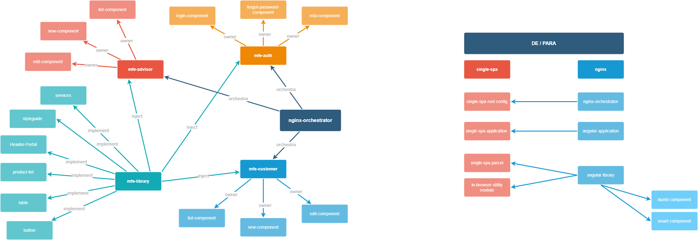

## Arquitetura MFE - Nginx / Library

## TASKS

### ORQUESTRATOR
- CRIAR E CONFIGURAR PROJETO NGINX ORCHESTRATOR - OK
		

### APLLICATIONS MFEs
- CRIAR APLICAÇÃO AUTH ANGULAR E CONFIGURAR NGINX - OK
- CRIAR APLICAÇÃO CUSTOMER ANGULAR E CONFIGURAR NGINX - OK
- CRIAR APLICAÇÃO ADVISOR ANGULAR E CONFIGURAR NGINX - OK
		

### PARCELS AND UTILS
- UTILS
	- CRIAR BIBLIOTECA STYLEGUIDE E PUBLICAR NO NPM - OK
		
- DUMB COMPONENT
	- CRIAR BIBLIOTECA DUMB-COMPONENT E PUBLICAR NO NPM - OK
		
- SMART COMPONENT
	- CRIAR BIBLIOTECA SMART-COMPONENT "HEADER" E PUBLICAR NO NPM - OK
	- CRIAR BIBLIOTECA SMART-COMPONENT "LISTA PRODUTOS" E PUBLICAR NO NPM - OK
			

### ENVIRONMENT CONFIGS
- CONFIGURAR VARIÁVEIS DE AMBIENTE ANGULAR NO DOCKER - OK

### GERENCIAMENTO DE ESTADOS 
- CRIAR BIBLIOTECA SERVICE E PUBLICAR NO NPM - OK